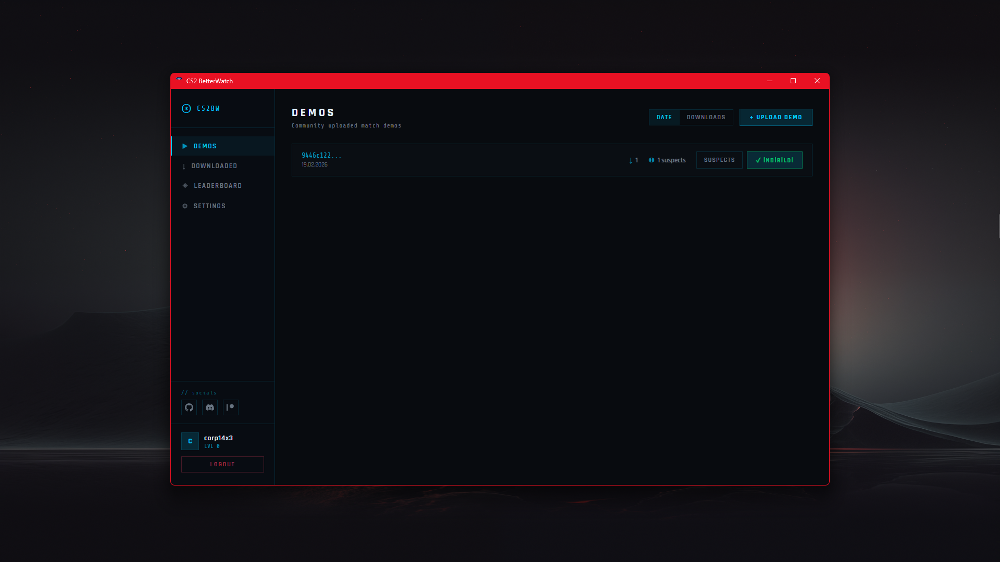
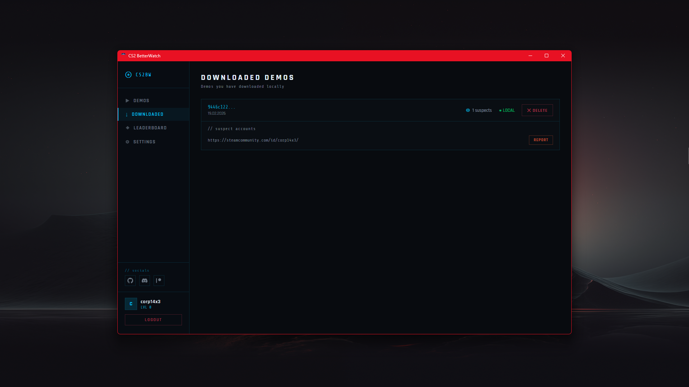
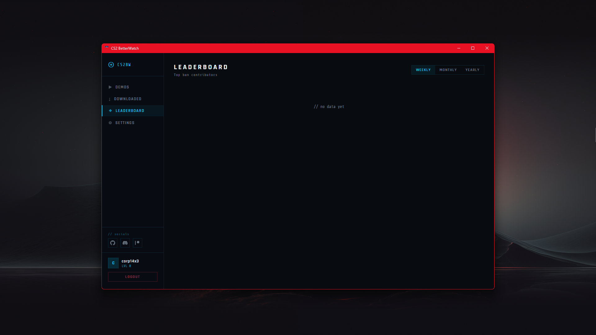
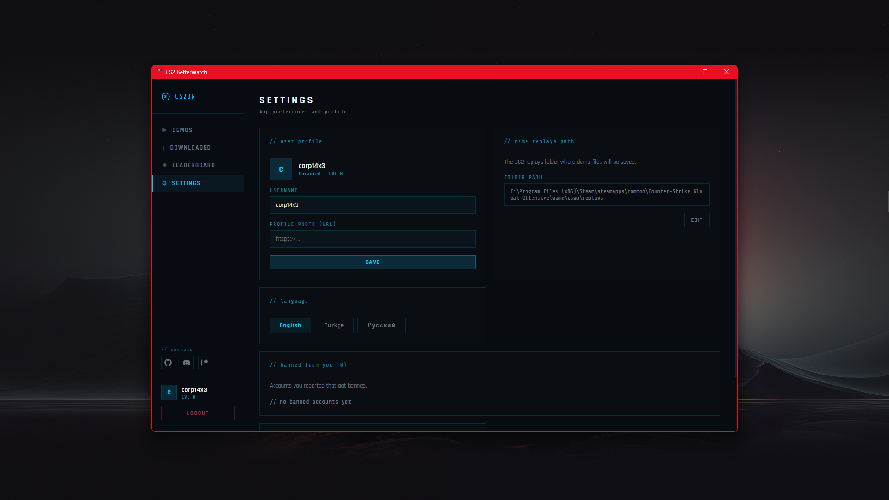

# CS2 BetterWatch

A community-driven ban tracker for CS2. Upload match demos, report suspicious players, and track who gets banned. Earn XP and climb the leaderboard by successfully getting cheaters banned.

## Footage




## Features

- 📁 **Demo Sharing** — Upload and download CS2 demo files from the community
- 🔍 **Suspect Reporting** — Report suspicious players directly from demos
- 🔨 **Ban Tracking** — Automatically checks Steam API for new bans on reported accounts
- 🏆 **Leaderboard** — Weekly, monthly, and yearly rankings for top ban contributors
- ⭐ **Rank System** — Earn XP when players you reported get banned, unlock ranks and badges
- 👤 **User Profiles** — View your banned accounts, rank, and badges

## Tech Stack

**Frontend:** React + Electron (Desktop App)  
**Backend:** Python + FastAPI  
**Database:** PostgreSQL  
**Steam Integration:** Steam Web API

## Installation

### Prerequisites
- Python 3.12
- Node.js (LTS)
- PostgreSQL

### Backend Setup

```bash
cd cs2_overwatch_backend

# Install dependencies
pip install -r requirements.txt

# Copy and fill in config
cp config.example.ini config.ini
# Edit config.ini with your DB credentials, Steam API key, and session secret

# Create the database
createdb cs2_overwatch

# Create demos folder
mkdir demos

# Start the server
python main.py
```

### Frontend Setup

```bash
cd cs2_overwatch_frontend

# Install dependencies
npm install

# Development
npm run start

# Build .exe
npm run dist
```

### Config

Copy `config.example.ini` to `config.ini` and fill in your values:

```ini
[database]
host = localhost
port = 5432
name = cs2_overwatch
user = postgres
password = YOUR_PASSWORD

[steam]
api_key = YOUR_STEAM_API_KEY  # https://steamcommunity.com/dev/apikey

[session]
secret_key = YOUR_RANDOM_SECRET_KEY
session_expire_minutes = 10080

[server]
host = 0.0.0.0
port = 8000
demo_upload_dir = demos
max_demo_size_mb = 200
```

## How It Works

1. **Upload a demo** — Attach the suspicious players' Steam profile links
2. **Community downloads** — Other users download and review the demo
3. **Report suspects** — Users can report players after downloading the demo
4. **Auto ban check** — Backend checks Steam API every 30 minutes for new bans
5. **Earn XP** — When a player you reported gets banned, you earn 1 XP
6. **Rank up** — Accumulate XP to unlock new ranks and badges

## Support

- [Discord](https://discord.com/invite/4xz9KhESbD)
- [Patreon](https://www.patreon.com/cw/corp14x3)
- [GitHub](https://github.com/corp14x3)
